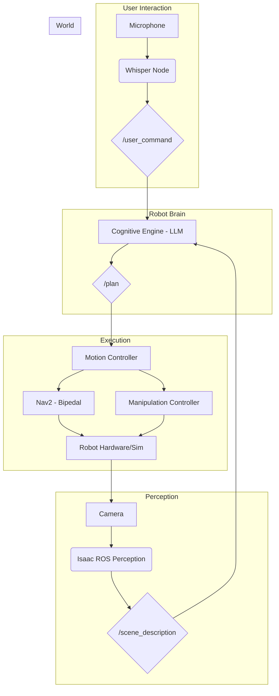

# Part VI: Capstone Project - The Autonomous Humanoid Assistant

This capstone project is where we bring together all the concepts, technologies, and skills developed throughout this book. The goal is to build an end-to-end Vision-Language-Action (VLA) pipeline for a humanoid robot, enabling it to act as an autonomous assistant in a simulated home or office environment.

## Project Goal

The objective is to create a system where a user can give high-level voice commands to the humanoid robot, and the robot will perceive its environment, reason about the command, and execute a sequence of actions to fulfill the user's request.

## Learning Objectives

By completing this capstone project, you will:
-   Gain hands-on experience in integrating multiple complex robotics systems (perception, navigation, manipulation, and language).
-   Learn how to build and configure a complete VLA pipeline using ROS 2.
-   Understand the practical challenges of grounding language models in a physical environment.
-   Develop a sophisticated robotics application that demonstrates a high level of autonomy and intelligence.

## The Scenario

We will simulate a simple room environment in NVIDIA Isaac Sim. The room will contain a table, a chair, a bin, and several objects (e.g., blocks of different colors, a cup). The user will interact with the robot through voice commands.

### Example Interaction:

-   **User**: "Robot, please pick up the red block and place it in the blue bin."
-   **Robot**: *Transcribes audio, understands the command, and identifies the objects. It then plans and executes the navigation and manipulation sequence.* "I have placed the red block in the blue bin."

## System Architecture

The entire system will be orchestrated using ROS 2. The diagram below illustrates the high-level architecture of the VLA pipeline and the communication between the key nodes.

## Core Components to Integrate

This project will require the integration of the entire stack we have discussed:

1.  **Simulation Environment (Isaac Sim)**: Create the room environment using USD and import the humanoid robot model.
2.  **Perception (Isaac ROS)**: Use Isaac ROS for object detection and pose estimation to build a world model.
3.  **Navigation (Nav2)**: Implement a customized Nav2 stack for bipedal navigation.
4.  **Language (Whisper + LLM)**: Use Whisper for speech transcription and an LLM for intent recognition and planning.
5.  **Manipulation**: Develop basic manipulation capabilities using inverse kinematics and motion planning.
6.  **Control and Integration (ROS 2)**: Orchestrate the entire system using ROS 2 nodes, topics, services, and actions.

## Software and Hardware Prerequisites

-   **Software**: ROS 2 Humble, NVIDIA Isaac Sim, Python 3.10+, and all the ROS 2 packages discussed in previous modules. Access to an LLM API (e.g., OpenAI, Anthropic).
-   **Hardware**: A computer with a powerful NVIDIA GPU (RTX 30-series or later recommended) to run Isaac Sim and the perception pipeline.

## Evaluation

The success of the project will be evaluated based on:
-   **Task Completion Rate**: How reliably can the robot complete a variety of commands?
-   **Robustness**: How well does the system handle variations in object placement and user commands?
-   **Safety**: Does the system have appropriate safety checks to prevent collisions and unsafe actions?

This capstone project is a challenging but rewarding endeavor that will solidify your understanding of how to build the next generation of intelligent, autonomous humanoid robots.

## Sources & References

- [Placeholder for Capstone Project specific sources]