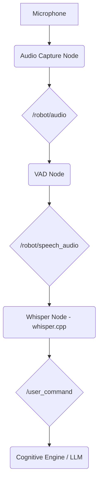

# Chapter 12: Voice Control with OpenAI Whisper

For humanoid robots to interact naturally and intuitively with humans, voice control is a crucial capability. OpenAI's **Whisper** is a state-of-the-art automatic speech recognition (ASR) model that can accurately transcribe human speech into text, making it an excellent foundation for building voice-controlled robotics systems.

## What is OpenAI Whisper?

Whisper is a pre-trained neural network that can transcribe audio from a wide range of languages and accents with remarkable accuracy. It was trained on a massive dataset of diverse audio, making it robust to background noise, different speaking styles, and technical jargon.

### Choosing a Whisper Model
Whisper comes in several sizes, from `tiny` to `large`. There is a trade-off between model size, speed, and accuracy:
-   **`tiny` and `base` models**: These are very fast and require minimal computational resources, making them suitable for real-time applications on embedded hardware like a Raspberry Pi or a Jetson Nano. However, their accuracy is lower.
-   **`small` and `medium` models**: These offer a good balance between speed and accuracy.
-   **`large` model**: This is the most accurate model, but it is also the most computationally expensive and may not be suitable for real-time applications without a powerful GPU.

For robotics, choosing the right model depends on the available hardware and the required level of accuracy.

## Real-Time Transcription and Voice Activity Detection (VAD)

A key challenge in voice control is achieving low-latency, real-time transcription. Running Whisper on a continuous audio stream can be inefficient. A better approach is to use **Voice Activity Detection (VAD)**.

A VAD algorithm is a simple process that listens to the audio stream and detects when a person starts and stops speaking. By using a VAD, you can:
1.  Avoid running the computationally expensive Whisper model on silence.
2.  Provide a better user experience by transcribing only complete sentences or phrases.
3.  Reduce the power consumption of the system.

A typical real-time pipeline would use a VAD to buffer audio chunks that contain speech and then send these chunks to Whisper for transcription.

## High-Performance Transcription with `whisper.cpp`

While OpenAI's official Whisper implementation is in Python, there is a highly optimized C++ port called **`whisper.cpp`**. This version is significantly faster and more memory-efficient, making it ideal for resource-constrained robotics platforms. It supports GPU acceleration (via CUDA) and can run on a wide range of hardware.

## Integrating Whisper into a ROS 2 System

A robust ROS 2 pipeline for voice control would look like this:

1.  **Audio Capture Node**: A node that interfaces with a microphone (e.g., using `alsa` or `pulseaudio`) and publishes the raw audio stream to a `/robot/audio` topic.
2.  **VAD Node**: Subscribes to the raw audio, runs a VAD algorithm, and publishes chunks of speech audio to a `/robot/speech_audio` topic.
3.  **Whisper Node**: This node subscribes to `/robot/speech_audio`. It wraps the `whisper.cpp` library to provide a high-performance transcription service. When it receives an audio chunk, it transcribes it and publishes the resulting text to a `/user_command` topic.
4.  **Cognitive Engine (LLM Node)**: Subscribes to `/user_command`. As discussed in the next chapter, this node is responsible for understanding the user's intent and generating a plan.

This modular architecture allows each component to be developed and tested independently. By combining a VAD with the highly optimized `whisper.cpp` library, you can build a responsive and accurate voice control system that serves as the primary human-robot interface for our humanoid.

## Sources & References

- [OpenAI Whisper GitHub Repository](https://github.com/openai/whisper)
- [whisper.cpp GitHub Repository](https://github.com/ggerganov/whisper.cpp)
- [Silero VAD](https://github.com/snakers4/silero-vad) - A popular, high-quality VAD library.